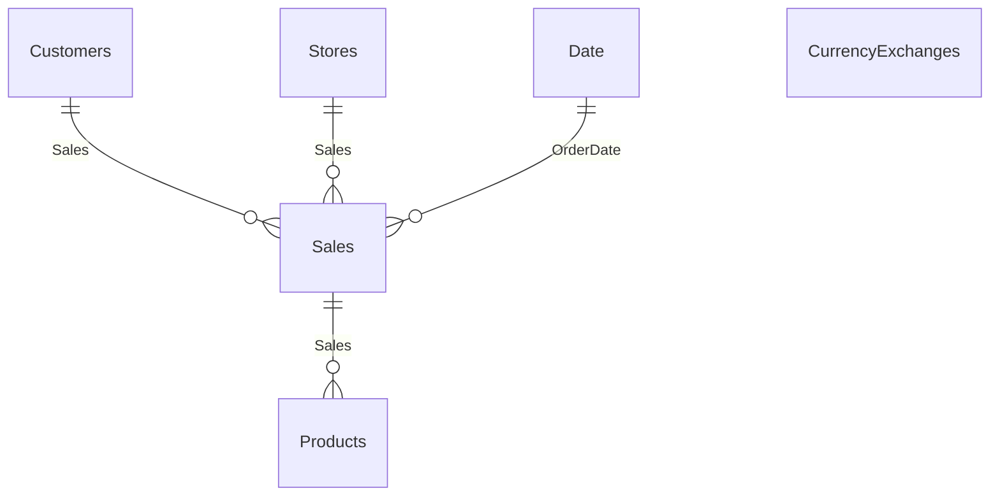
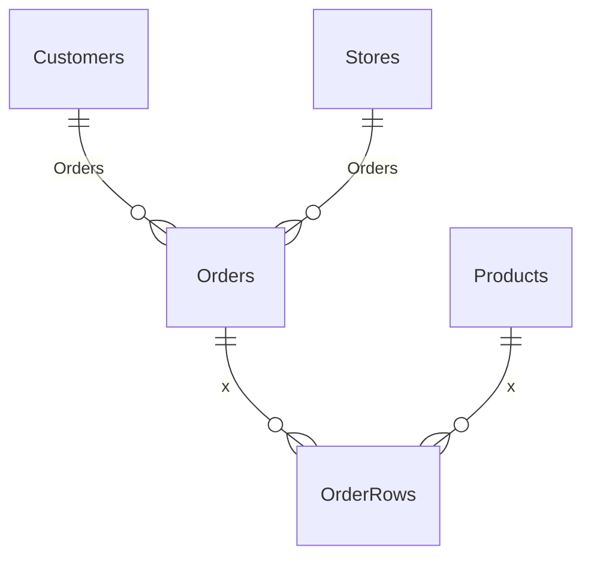

# ContosoCorporation

## Table of Contents <!-- omit in toc -->

- [Overview](#overview)
- [The data model](#the-data-model)
- [Development](#development)
  - [How the project was initialized](#how-the-project-was-initialized)
  - [How to use sample database](#how-to-use-sample-database)
  - [Scaffolding (Reverse Engineering)](#scaffolding-reverse-engineering)

## Overview

This project is a sample library used in other test projects.

Here, we will use "Contoso Corporation," a fictional company that Microsoft uses for sample purposes.

The following site was used as reference:

- [Overview of Contoso Corporation - Microsoft 365 Enterprise | Microsoft Learn](https://learn.microsoft.com/ja-jp/microsoft-365/enterprise/contoso-overview?view=o365-worldwide)

Sample data for Contoso Corporation is available at the following website:

- [sql-bi/Contoso-Data-Generator: Custom Contoso database generator and ready-to-use Contoso sample databases for SQL Server](https://github.com/sql-bi/Contoso-Data-Generator/tree/main)
- [Release Ready to use data · sql-bi/Contoso-Data-Generator-V2-Data](https://github.com/sql-bi/Contoso-Data-Generator-V2-Data/releases/tag/ready-to-use-data)

## The data model

The following sections create a data model:





## Development

### How the project was initialized

This project was initialized with the following command:

```shell
## Solution
dotnet new sln -o .

## ContosoCorporation
dotnet new classlib -o src/ContosoCorporation
dotnet sln add src/ContosoCorporation
cd src/ContosoCorporation

dotnet add package Microsoft.Data.SqlClient
dotnet add package Microsoft.EntityFrameworkCore.Design
dotnet add package Microsoft.EntityFrameworkCore.SqlServer

cd ../../

# Update outdated package
dotnet list package --outdated
```

### How to use sample database

Get Contoso sample data (e.g. if you use 100K):

```shell
wget https://github.com/sql-bi/Contoso-Data-Generator-V2-Data/releases/download/ready-to-use-data/bak-ContosoV2-100k.7z 
```

Unzip the 7Zip file.

7zip is probably not included in the container, so you may need to install it using apt. This is not necessary if you can unzip the file on the host machine.

```shell
7z x bak-ContosoV2-100k.7z 
```

```console
$ ls -lR

.:
total 14808
-rw-r--r-- 1 root root 14967014 Sep 21 09:36 bak-ContosoV2-100k.7z
drwx------ 3 1000 1000       96 Oct 26 08:28 dump

./dump:
total 112784
-rw-r--r-- 1 1000 1000 115490816 Sep 20 17:16 ContosoV2100k.bak
```
<!-- spell-checker: words drwx -->

Copy to container:

```shell
docker cp ./dump/ContosoV2100k.bak examples-dotnet-database_devcontainer-mssql-1:/var/opt/mssql/data
```

Enter the container:

```shell
docker exec -it examples-dotnet-database_devcontainer-mssql-1 bash
```

Use sqlcmd to log in to the database.

```shell
/opt/mssql-tools18/bin/sqlcmd -C -U sa -P `cat /run/secrets/db_password` 
```

Restore Database:

```sql
RESTORE DATABASE Contoso FROM DISK = N'/var/opt/mssql/data/ContosoV2100k.bak' WITH
  MOVE 'Contoso V2 100K' TO N'/var/opt/mssql/data/ContosoV2.mdf',
  MOVE 'Contoso V2 100K_Log' TO N'/var/opt/mssql/data/ContosoV2.ldf';
GO
```sql

```console
データベース 'Contoso' の 13928 ページ、ファイル 1 のファイル 'Contoso V2 100K' を処理しました。
データベース 'Contoso' の 2 ページ、ファイル 1 のファイル 'Contoso V2 100K_log' を処理しました。
RESTORE DATABASE により 13930 ページが 0.223 秒間で正常に処理されました (488.000 MB/秒)。
```

I will check the restored database:

```sql
SELECT substring(name,1,20) as name, database_id, create_date FROM sys.databases;
GO
```

```console
name                 database_id create_date            
-------------------- ----------- -----------------------
master                         1 2003-04-08 09:13:36.390
tempdb                         2 2025-10-26 07:56:50.130
model                          3 2003-04-08 09:13:36.390
msdb                           4 2025-08-11 14:05:56.193
Contoso                        5 2025-10-26 08:05:49.460

(5 rows affected)
```

### Scaffolding (Reverse Engineering)

To run Scaffold, you need the `dotnet-ef` tool, the `Microsoft.EntityFrameworkCore.Design` package, and a database provider package.

Here, we are working within the `Examples.EntityFrameworkCore.SqlServer.Tests` project.

```shell
dotnet ef dbcontext scaffold "Data Source=sqlserver;Initial Catalog=Contoso;User ID=sa;Password=$(cat /run/secrets/db_password);Persist Security Info=False;TrustServerCertificate=yes" Microsoft.EntityFrameworkCore.SqlServer --context-dir Data --context-namespace ContosoCorporation.Data --output-dir Models --namespace ContosoCorporation.Models --no-onconfiguring
```
<!-- spell-checker: words onconfiguring -->

```console
$ ls -lR ContosoCorporation/
ContosoCorporation/:
total 0
drwxr-xr-x  3 vscode vscode  96 Oct 26 21:32 Data
drwxr-xr-x 16 vscode vscode 512 Oct 26 21:32 Models

ContosoCorporation/Data:
total 16
-rw-r--r-- 1 vscode vscode 15799 Oct 26 21:32 ContosoContext.cs

ContosoCorporation/Models:
total 56
-rw-r--r-- 1 vscode vscode  333 Oct 26 21:32 CurrencyExchange1.cs
-rw-r--r-- 1 vscode vscode  332 Oct 26 21:32 CurrencyExchange.cs
-rw-r--r-- 1 vscode vscode  683 Oct 26 21:32 Customer1.cs
-rw-r--r-- 1 vscode vscode 1336 Oct 26 21:32 Customer.cs
-rw-r--r-- 1 vscode vscode  912 Oct 26 21:32 Date1.cs
-rw-r--r-- 1 vscode vscode  963 Oct 26 21:32 Date.cs
-rw-r--r-- 1 vscode vscode  637 Oct 26 21:32 Order.cs
-rw-r--r-- 1 vscode vscode  570 Oct 26 21:32 OrderRow.cs
-rw-r--r-- 1 vscode vscode  774 Oct 26 21:32 Product1.cs
-rw-r--r-- 1 vscode vscode  934 Oct 26 21:32 Product.cs
-rw-r--r-- 1 vscode vscode  709 Oct 26 21:32 Sale1.cs
-rw-r--r-- 1 vscode vscode  922 Oct 26 21:32 Sale.cs
-rw-r--r-- 1 vscode vscode  513 Oct 26 21:32 Store1.cs
-rw-r--r-- 1 vscode vscode  773 Oct 26 21:32 Store.cs
```
<!-- spell-checker: words drwxr -->

Upon reviewing the generated files, it appears there is duplication between the tables and views. Since we are not managing the migrations in this case, we will modify the files after they have been generated.
