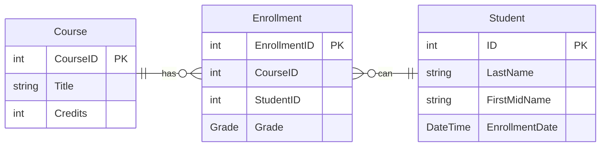

# ContosoUniversity

## Table of Contents <!-- omit in toc -->

- [Overview](#overview)
- [The data model](#the-data-model)
- [Development](#development)
  - [How the project was initialized](#how-the-project-was-initialized)

## Overview

This project is a sample library that extracts the infrastructure layer of a fictional Contoso University and is referenced by other test projects for learning purposes.

The following site was used as reference:

- [ASP.NET Core Razor Pages with Entity Framework Core - Tutorial 1/8](https://docs.microsoft.com/ja-jp/aspnet/core/data/ef-rp/intro)

## The data model

The following sections create a data model:



## Development

### How the project was initialized

This project was initialized with the following command:

```shell
## Solution
dotnet new sln -o .

## ContosoUniversity
dotnet new classlib -o src/ContosoUniversity
dotnet sln add src/ContosoUniversity
cd src/ContosoUniversity

# for Infrastructure layer
dotnet add package Microsoft.EntityFrameworkCore.Relational
cd ../../

# Update outdated package
dotnet list package --outdated
```
